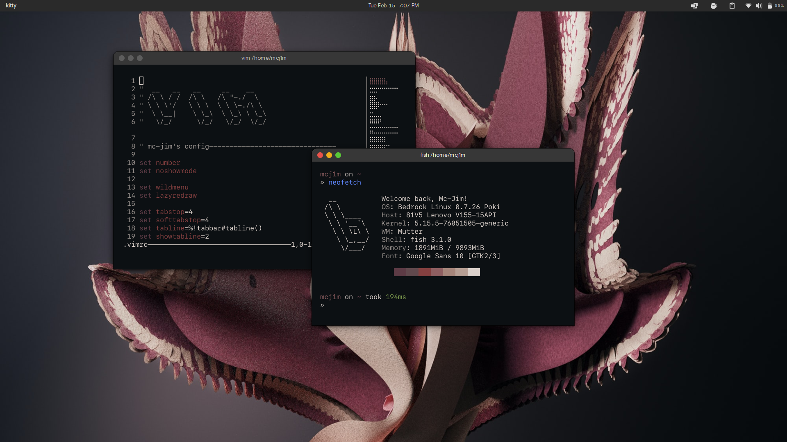

# My dotfiles

Screenshot:

## What I use

Distro & environment:
- bedrock linux (w/Pop!\_Os & Void)
- Gnome with lots of extensions and different themes
  - WhiteSur Monterrey GTK & Firefox theme (https://github.com/vinceliuice/WhiteSur-gtk-theme)
  - Stock Pop icons
  - Qogir-cursors (https://www.gnome-look.org/p/1366182)
  - Google Sans Font

Software seen on screenshot:
- kitty
- fish
- starship
- vim
- neofetch

Enjoy :)
