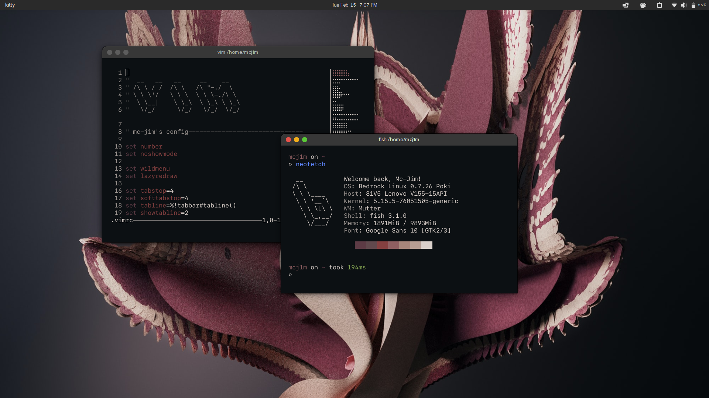

# My dotfiles

Screenshot:

## What I use

Distro & environment:
- bedrock linux (w/Pop!\_Os & Void)
- Gnome with lots of extensions and different themes
  
  Themes:
  - WhiteSur Solid GTK & Firefox theme (https://github.com/vinceliuice/WhiteSur-gtk-theme) (Apps, Shell & Firefox)
  - Stock Pop icons
  - Qogir-cursors (https://www.gnome-look.org/p/1366182)
  
  Extensions (just the ones that are needed for the layout):
  - Arc Menu (just to change activities icon cuz JustPerfection didn't work)
  - BigAvatar
  - executor (to put the seperator between clock and others)
  - JustPerfection
  - Native Window Placement
  - Unite
  - User Themes
  
  - Weeks Start On Monday Again
 - pywal (https://github.com/dylanaraps/pywal)
   - apply with: ``wal -i /path/to/AfterHours.png -b 242424``

Don't remeber the source of the wallpaper tho... 

Software seen on screenshot:
- kitty
- fish
- starship
- vim
- neofetch

## Fonts:
Interface: Google Sans Font   
Mono (terminal font): SF Mono Regular

Enjoy :)
